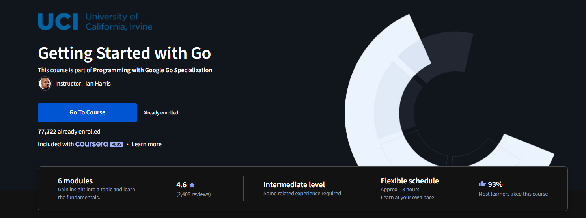

# Week 1 Learning Log

## I've learned about the following topics:

### GO

- How to create a directory in Go
- How to create a file in Go
- How to create a package in Go

#### Insights:

Everything inside Go is fragile and i have to lead the directory structure carefully and with precision, kind of like leading the computer by handholding it along the way.
Blank space is between the code adds readability and its allowed inside go, a thing to keep in mind when writing code.

### CSS

- played around with css and my obsidians vault, experimented with different Features, HSL color editing, and how to use it to make my vault look better.
- learned a little how to prompt the AI to generate css code snippets and how to use them in my vault.

#### Thoughts:

CSS is a nice toy to play with, i asked Claude to generate me a skeleton like CSS snippet so i could customize the features i wanted to use in my vault, ive also vibe coded to see what kind of results or features it would generate but it fails at creativity, or im just inadequately prompting it, i will try to learn more about CSS to perhaps one day customize my vault even better.

### Github

-How to transfer other peoples projects into my repository well, cloning them

- How to use GitHub, branches, and commits

#### Thoughts:

Github is one of my favorite tools, it allows me to see so many details, even if u fail at something or save a file with a mistake, you can always go back and see what you did wrong, or even revert to a previous version of the file, remote repositories and the way it tracks everything, BRILLIANT SYSTEM!

## To do:

- Sucesfully learning syntax
- understanding how to use github and transfer other peoples projects into my repository i want to still further dive into this topic SSH link thing interests me.
  Currently im learning the basics of GO on coursera  and the tour of go on the side.

## ehh.go

i generated a tic tac toe game using gemini to learn a little about it and how it works, i will be using it to generate code snippets and dissect it and learn more about the language.

- Currently experiencing on sites and in vs code by breaking stuff down and seeing alternatives
