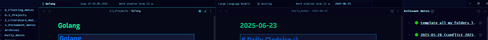

# Golang learning log - Week 4

## Skills i gotta learn

- git and github fluency and basics
- stopping boot.dev for a little and make my own projects simple ones really just to practice the concepts and ingrian them into my head.
- ide mastery, im using vscode and i must say it's extremely good and refined but i'd prefer something less bloated and less shinier there's so many stuff i do not use inside of it ctrl t, ctrl n, ctrl w, ctrl+shift+s all i know about lol.

## notes from boot.dev:

- Function currying is a concept from functional programming and involves partial application of functions. It allows a function with multiple arguments to be transformed into a sequence of functions, each taking a single argument.

Blocks are defined by curly braces {}. New blocks are created for:

    Functions
    Loops
    If statements
    Switch statements
    Select statements
    Explicit blocks
    i sometimes forget them for else statements

## Stuff i learned this week:

- Operators with if statements: _Gotta keep those in mind_
- `>` greater than
- `<` less than
- `>=` greater than or equal to
- `<=` less than or equal to
- `==` equal to
- `!=` not equal to

---

- defer statements: they stop and execute till the end of the surrounding functions.
- early returns, amazing for error handling and avoiding nested if statements. stops before the snowball effect happens.
- fmt.scan: scans for user input whether its a string, float64, int etc. you gotta create an empty variable before hand and assign the scanned input to it. it essentially replaces the variable with the user input.
- currying functions, the idea to split a function with multiple parameters into multiple functions with one herited parameter. its unecessearly complex, alot of mental strain if i do not write it myself.
- closures: functions that are copied and stored in a variable. they have a compounding effect and take the characteristics of the surrounding function. say like poppy := func dada() and then theres multiple of them and now poppy has the characteristics of dada. i think i got it right. but lets say u print poppy() once, all the other poppy() will be printed as well. just one call of the print and it prints everything inside the main function for example.
  

## Projects:

i made my own version of a simple and boring calculator, u insert two numbers and it returns the calculated result of the two numbers based on the operator you chose. I'ts boring and one dimensional. teached me about a early return though.
deroda.go and calculator.go // ill post the project in a seperate folder.

## future reviews:

- importing and reviewing specific packages and what they offer, i know about math,time,fmt but i just scratched the surface of their capablities.
- functions and how to name and use them properly i get sometimes confused with the syntax like func hello(func()hiiii()func()) and let's pretend there's stuff inside them

## Wins:

- I've sucesfully built a calculator with user input and error handling. im feeling really proud of myself, i never thought i'd be able to do it this fast, the joy i felt when i made it work the first time ... it was magical. thanks to vscode u can see beforehand when itll break and why and that gives me alot of insight as to how to build something working. im gonna want to expand onto this project and make it more complex and add more features to it. maybe a gui version of it. I've had claude explain to me about fmt.scan but it's pretty simple it just scans for the input and assigns it to the empty variable u created before hand.

## Polishing:

- i've understood nested statements of if, else etc and this calculator project made me realize that its best if you build stuff yourself.
  notes:
- gotta become a paid member of boot.dev to access the projects and the rest of the course im gonna do that tomorrow and continue my learning journey. i think its the only course im gonna ever pay for. i want the knowledge and move on from there on my own.
- finished functions now onto structs.
