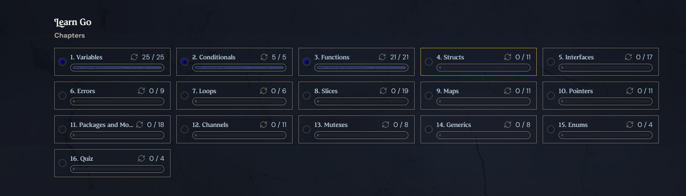

# Golang learning log - Week 4

## Skills i gotta learn

- git and github fluency and its basics, pull fetch, commit the interactivity between local and my remote repo. i do not know much about it yet.
- make my own projects with the knowledge i already possess, an idea and executing without overthinking it.
- ide mastery, im using vscode and i must say it's extremely good and refined but i'd prefer something less bloated and less shinier there's so many stuff i do not use inside of it ctrl t, ctrl n, ctrl w, ctrl+shift+s all i know about lol.

## notes from boot.dev:

- Function currying is a concept from functional programming and involves partial application of functions. It allows a function with multiple arguments to be transformed into a sequence of functions, each taking a single argument.

Blocks are defined by curly braces {}. New blocks are created for:

    Functions
    Loops
    If statements
    Switch statements
    Select statements
    Explicit blocks
    i sometimes forget them for else statements

## Stuff i learned this week:

- Operators with if statements: _Gotta keep those in mind_
- `>` greater than
- `<` less than
- `>=` greater than or equal to
- `<=` less than or equal to
- `==` equal to
- `!=` not equal to

---

- defer statements: they stop and execute till the end of the surrounding functions.
- early returns, amazing for error handling and avoiding nested if statements. stops before the snowball effect happens.
- fmt.scan: scans for user input whether its a string, float64, int etc. you gotta create an empty variable before hand and assign the scanned input to it. it essentially replaces the variable with the user input.
- currying functions, the idea to split a function with multiple parameters into multiple functions with one herited parameter. its unecessearly complex, alot of mental strain if i do not write it myself.
- closures they are function that close over variables from their surrounding scope they can modify the variables from the surrounding scope. and persist until the surrounding function ends.
  a little example:

```go func counter() func() int {
    count := 0
    return func() int {
        count++
        return count
    }
}

c1 := counter()
c1() // returns 1
c1() // returns 2
c2 := counter()
c2() // returns 1 a seperate instance
```
- scanning for erros, error handling generally, if a requirment is not met i learned how to print a message and stop the program from continuing. very useful for user input.
- strconv package: converting strings to floats, useful for filtering user input. and helps with error handling. makes the program run as intended. 
- I've learned how to use if, else if, else statements properly and how to nest them. also learned about switch statements and i sucesfully used the switch statement inside my calculator project.
- I've learned about loops and how to loop properly using for loops and how to use break and continue statements inside of them. also learned about infinite loops and how to break out of them. had been stuck on a problem because i didnt notice it was inside another for loop. for like an hour (facepalm).

## Projects:

i made my own version of a simple and boring calculator, u insert two numbers and it returns the calculated result of the two numbers based on the operator you chose. I'ts boring and one dimensional. teached me about a early return though.
deroda.go and calculator.go // ill post the project in a seperate folder.

## future reviews:

- importing and reviewing specific packages and what they offer, i know about math,time,fmt but i just scratched the surface of their capablities.
- functions and how to name and use them properly i get sometimes confused with the syntax like func hello(func()hiiii()func()) and let's pretend there's stuff inside them

## Wins:

- I've sucesfully built a calculator with user input and error handling. im feeling really proud of myself, i never thought i'd be able to do it this fast, the joy i felt when i made it work the first time ... it was magical. thanks to vscode u can see beforehand when itll break and why and that gives me alot of insight as to how to build something working. im gonna want to expand onto this project and make it more complex and add more features to it. maybe a gui version of it. I've had claude explain to me about fmt.scan but it's pretty simple it just scans for the input and assigns it to the empty variable u created before hand.
- _this also comes with many failures, ive been stuck on defer statements for a whole day, i just couldnt understand it. the hierarchy of the code matters alot when it comes to defer statements. same goes for anonymous function and closures. I still would struggle with this stuff even now. much polishing is needed._
- I have finished my calculator project with user input and error handling, along with rigid looping. it does not let you bypass the number requirment with strings or symbols. It has type checking, loop control and input validation. It's currently only able to do one calculation at a time, but I am currently working on adding contiunous calculations.

## Failures:
was stuck on a simple error for 2 whole hours, i did come home from work a little tired, the condition check for errors felt confusing ive already wrote a function that returns a error in a seperate file and i overwrote my own check for error inside main for 3 whole times, the definition of insanity: expecting stuff to change despite doing the same ass thing. 
## Polishing:

- i've understood nested statements of if, else etc and this calculator project made me realize that its best if you build stuff yourself.
- sometimes sitting and not seeking resources is the key to actually make stuff work, unless u are trying to add something novel. What I've noticed is sitting and just coding on and off, trial and error is just all you really need to make stuff work.

## Notes:

- gotta become a paid member of boot.dev to access the projects and the rest of the course im gonna do that tomorrow and continue my learning journey. i think its the only course im gonna ever pay for. i want the knowledge and move on from there on my own.
- finished functions now onto structs.
- Writing code in Vscode is very comfortable knowing errors that are bound to happen beforehand. gives me a perspective on where i should focus on.
- I've had moments where basic syntax felt alien to me, been stuck on a problem for 2 hours i tackled on more than i could handle but the next day i woke up read some documentations, and realized that the solution was much simpler than i realized.
- coding is no easy feat and i really respect anybody who does that for a living while being under stress and deadlines.
- I'ts too bad u cant split return values from functions, say u have 2-3 return values and u wanna return them individually specifically if they meet conditions. instead u have to always return all 3 black and white. Kinda.
- Testing your code is a great way to learn and understand the limiting factors of your knowledge and the language itself. It gives you a perspective and forces you to take another approach.


# Short summary for week 4 
- been busy with my waiter work but i still managed to learn alot of stuff on the side. i have built this calculator project which im gonna refine, *Maybe add a gui* and I am gonna resume with boot.dev currently haven't bought the monthly subscription yet. The contents inside have been helpful
- I also have to learn git my inadequacy and me being illiterate with git and github has been a annoying experience. There is much to work on that part.
## BOOT.DEV progress

