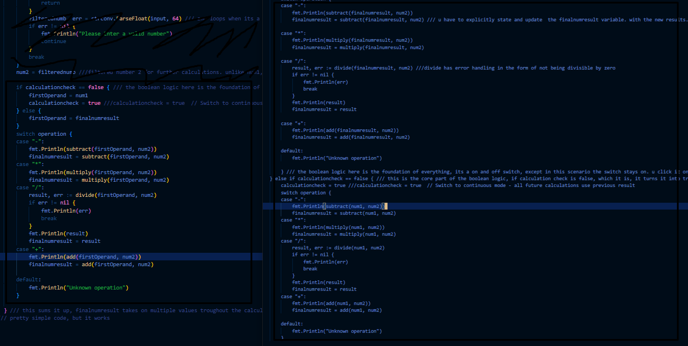

# Golang learning log - Week 4
## Skills to learn:
- Git and Github fluency and learning the commands and navigation
- Planning and realizing project ideas
- Focusing on one thing at a time and doing it good enough (i have a tendency to jump around topics and not stick to one thing)
## Current plans:
- im gonna refine the calculator and finish it. 
- [] adding a way to track every past calculations(history with a slice) 
- [] moving the calculations into its own package( not a feature )
- [x]continuous calculation
- [] word counter using map[string] int
- [] a system to automaticly exit if the input is repeated and the program does not execute as designed.
## Progress: 
progress and toughts:
currently im implementing the continous calculations ive been thinking of if operators in order for the calculations to never fuck up and be consistent. the code is pretty self explanatory but i believe i implemented alot of unecessary complex design patterns. if i could simplify it i would, but i lack knowledge.
## End of week 5 progress. 
- currently im fixing the issue within the continous calculation, i have to redefine the result one more time, it was hard to track this thing down. i forgot to essentially update the second loop iteration with the fresh result. i tought it was some variable issue but it was not
- i learned a bunch of stuff about git and github, push pull merge, commit. I have learned how to organize it better aswell.
- I am gonna resume boot.dev once i am done with my calculator.
## Random blabber
- been fun thinking about designs and how to potentially implement specific features at work. programming is truly an art of it's own. sinking my time inside of it has been as good as it gets whether games, work, reading mangas, entertainment. that kind of stuff feels good but it ain't productive and it doesnt really challenge you in such a capacity as coding and problem solving does.
## Summary
- I finished my calculator along with error handling, continous calculations, took me quite a while, i'm thinking of adding more features to it. I believe it's a pretty clean and understandable code. i will document it so it makes sense
- i cleaned up my calculator code with the help of claude *he gave me some useful insights as to how to clean it up and make it more readable*, added comments, completely scrapped my past switch logic with a new variable ( much, much cleaner than before) here is an example:
 night and day difference ( i didn't think it was possible to do that, but now that i know of it it makes so much sense.)

- _things i wanna achieve in the context of the calculator_
Add history with a slice (print past calculations).
Move math ops into their own package.
Word Counter: Input a sentence → return frequency of each word using map[string]int.
len and cap understanding and implementation
- here are some things i want to achieve
Can you explain slices vs arrays and demonstrate len/cap?
Can you handle user input without panic on bad data? *( i believe this one in the context of the calculator is done).*
Can you split code into packages and import correctly?

ALOT OF WORK ahead of me 