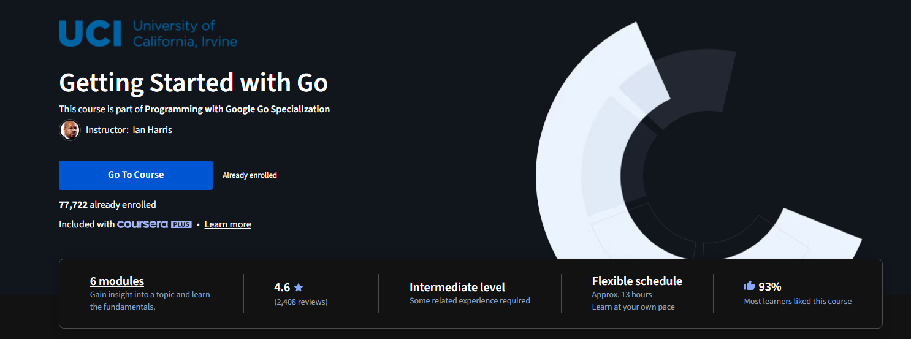

# Week 1 Learning Log

## I've learned about the following topics:

### GO

- How to create a directory in Go
- How to create a file in Go
- How to create a package in Go

### Github

-How to transfer other peoples projects into my repository well, cloning them

- How to use GitHub, branches, and commits

## Insights:

Everything inside Go is fragile and i have to lead the directory structure carefully and with precision, kind of like leading the computer by handholding it along the way.
Blank space is between the code adds readability and its allowed inside go, a thing to keep in mind when writing code.

## Toughts:

Learned about directories, Files and Packages in Go very very confusing at first but i feel relieved now. now that everything has some logical sense its easier to grasp the concepts.

Learned a little about Github, Branches and Commits i still cant fully grasp it git pull git push and git fetch on a fundamental level are simple but the navigation is still tough.

## To do:

- Sucesfully learning syntax
- understanding how to use github and transfer other peoples projects into my repository i want to still further dive into this topic SSH link thing interests me.
  Currently im learning the basics of GO on coursera  and doing

## ehh.go

i generated a tic tac toe game using gemini to learn a little about it and how it works, i will be using it to generate code snippets and dissect it and learn more about the language.

- Currently experiencing on sites and in vs code by breaking stuff down and seeing alternatives
