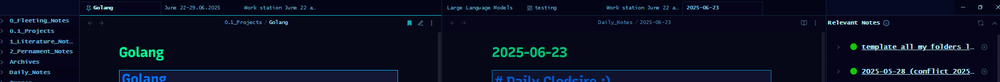

#Week 2 Learning Log

## I've learned about the following topics:

#CCS

## What i've learned:

- How to use CSS to style my Obsidian vault
- How to use CSS variables for theming
  -Slightly understanding the concept of declaring variables in CSS and connecting them to hsl colors for specific changes
- How to use CSS to create a consistent look and feel across my vault

## Thoughts:

Extremely frustrating at first its not my type of thing, with the help of claude i was able to generate and learn about css generally, i dont think i've even gotten to the top of the iceberg yet, in the future i will try to customize other stuff but for now im done with my obsidian vault.
here is some code i generated with the help of claude and customized it to my liking:  
how it presents in my vault:


###

````css
/* ===== OBSIDIAN COLOR CUSTOMIZATION SKELETON ===== */
/* Edit the HSL values below to customize your theme */

.theme-light {
    /* === BACKGROUND COLORS === */
    --bg-primary: hsla(0, 0%, 0%, 0.295);
    /* Main background - COMPLETELY BLACK */
    --bg-secondary: hsl(0, 62%, 40%);
    /* Sidebar, panels */
    --bg-tertiary: hsl(0, 53%, 17%);
    /* Hover states */
    --bg-accent: hsl(212, 91%, 17%);
    /* Selected items */

    /* === TEXT COLORS === */
    --text-normal: hsl(210, 80%, 85%);
    /* Main text - Light blue for contrast on black */
    --text-muted: hsl(210, 60%, 70%);
    /* Secondary text */
    --text-faint: hsl(210, 40%, 55%);
    /* Disabled text */
    --text-on-accent: hsl(0, 84%, 49%);
    /* Text on accent bg */

    /* === HEADING COLORS - ABYSS BLUE THEME === */
    --h1-color: hsl(220, 100%, 75%);
    /* H1 headings - Bright abyss blue */
    --h2-color: hsl(215, 90%, 70%);
    /* H2 headings - Deep ocean blue */
    --h3-color: hsl(210, 85%, 65%);
    /* H3 headings - Mid abyss blue */
    --h4-color: hsl(205, 80%, 60%);
    /* H4 headings - Darker blue */
    --h5-color: hsl(200, 75%, 55%);
    /* H5 headings - Deep blue */
    --h6-color: hsl(195, 70%, 50%);
    /* H6 headings - Deepest blue */

    /* === TEXT FORMATTING - ABYSS PALETTE === */
    --bold-color: hsl(190, 100%, 80%);
    /* Bold text - Bright cyan-blue */
    --italic-color: hsl(240, 100%, 32%);
    /* Italic text - Purple-blue */
    --highlight-color: hsla(220, 100%, 25%, 0);
    /* Highlighted text bg - Dark blue highlight */
    --strikethrough-color: hsla(210, 50%, 45%, 0);
    /* Strikethrough text - Muted blue */

    /* === ACCENT COLORS === */
    --accent-primary: hsl(210, 100%, 50%);
    /* Links, buttons */
    --accent-secondary: hsl(30, 100%, 50%);
    /* Secondary accents */
    --accent-hover: hsl(210, 100%, 60%);
    /* Hover states */
    --accent-active: hsl(210, 100%, 40%);
    /* Active states */

    /* === BORDERS & DIVIDERS === */
    --border-color: hsl(210, 60%, 30%);
    /* General borders - Dark blue */
    --border-focus: hsl(210, 100%, 50%);
    /* Focused elements */
    --divider-color: hsl(210, 40%, 20%);
    /* Dividers - Very dark blue */

    /* === CODE & SYNTAX === */
    --code-bg: hsl(220, 40%, 10%);
    /* Code block background - Very dark blue */
    --code-text: hsl(190, 60%, 70%);
    /* Code text - Light blue */
    --code-border: hsl(210, 50%, 25%);
    /* Code block border */
    --inline-code-bg: hsl(215, 50%, 15%);
    /* Inline code bg */
    --inline-code-text: hsl(180, 70%, 65%);
    /* Inline code text - Cyan-blue */

    /* === TAGS === */
    --tag-bg: hsl(199, 62%, 30%);
    /* Tag background */
    --tag-text: hsl(200, 80%, 30%);
    /* Tag text */
    --tag-border: hsl(200, 40%, 70%);
    /* Tag border */

    /* === LINKS === */
    --link-color: hsl(210, 100%, 45%);
    /* Internal links */
    --link-external: hsl(280, 80%, 50%);
    /* External links */
    --link-unresolved: hsl(0, 60%, 50%);
    /* Unresolved links */
    --link-hover: hsl(210, 100%, 60%);
    /* Link hover */

    /* === UI ELEMENTS === */
    --checkbox-color: hsl(190, 80%, 60%);
    /* Checkboxes - Abyss blue */
    --checkbox-bg: hsl(0, 0%, 100%);
    /* Checkbox background */
    --button-bg: hsl(0, 0%, 95%);
    /* Button background */
    --button-hover: hsl(0, 0%, 90%);
    /* Button hover */
    --input-bg: hsl(0, 0%, 100%);
    /* Input background */
    --input-border: hsl(0, 0%, 80%);
    /* Input border */

    /* === SPECIAL ELEMENTS === */
    --blockquote-border: hsl(210, 70%, 60%);
    /* Blockquote left border - Abyss blue */
    --blockquote-bg: hsl(220, 30%, 8%);
    /* Blockquote background - Very dark blue */
    --table-header-bg: hsl(215, 40%, 15%);
    /* Table header - Dark blue */
    --table-border: hsl(210, 50%, 30%);
    /* Table borders */
    --table-row-alt: hsl(220, 30%, 5%);
    /* Alternating table rows - Almost black blue */
}

.theme-dark {
    /* === BACKGROUND COLORS === */
    --bg-primary: hsl(210, 50%, 15%);
    /* Main background - COMPLETELY BLACK */
    --bg-secondary: hsl(204, 85%, 8%);
    /* Sidebar, panels */
    --bg-tertiary: hsl(231, 70%, 45%);
    /* Hover states */
    --bg-accent: hsl(211, 48%, 34%);
    /* Selected items */

    /* === TEXT COLORS === */
    --text-normal: hsl(190, 70%, 80%);
    /* Main text - Light abyss blue */
    --text-muted: hsl(200, 50%, 60%);
    /* Secondary text */
    --text-faint: hsl(210, 30%, 40%);
    /* Disabled text */
    --text-on-accent: hsl(221, 51%, 31%);
    /* Text on accent bg */

    /* === HEADING COLORS - ABYSS BLUE THEME === */
    --h1-color: hsl(250, 98%, 21%);
    /* H1 headings - Brightest abyss blue */
    --h2-color: hsl(221, 100%, 50%);
    /* H2 headings - Bright ocean blue */
    --h3-color: hsl(253, 100%, 65%);
    /* H3 headings - Mid-bright abyss blue */
    --h4-color: hsl(210, 75%, 13%);
    /* H4 headings - Medium blue */
    --h5-color: hsl(215, 80%, 65%);
    /* H5 headings - Deeper blue */
    --h6-color: hsl(220, 75%, 60%);
    /* H6 headings - Deepest blue */

    /* === TEXT FORMATTING - ABYSS PALETTE === */
    --bold-color: hsl(162, 93%, 33%);
    /* Bold text - Bright cyan-blue */
    --italic-color: hsl(283, 100%, 50%);
    /* Italic text - Bright purple-blue */
    --highlight-color: hsl(0, 0%, 0%);
    /* Highlighted text bg - Dark blue highlight */
    --strikethrough-color: hsl(200, 40%, 50%);
    /* Strikethrough text - Muted blue */

    /* === ACCENT COLORS === */
    --accent-primary: hsl(253, 79%, 20%);
    /* Links, buttons */
    --accent-secondary: hsl(30, 100%, 60%);
    /* Secondary accents */
    --accent-hover: hsl(210, 100%, 70%);
    /* Hover states */
    --accent-active: hsl(210, 100%, 50%);
    /* Active states */

    /* === BORDERS & DIVIDERS === */
    --border-color: hsl(200, 60%, 25%);
    /* General borders - Dark abyss blue */
    --border-focus: hsl(200, 80%, 40%);
    /* Focused elements */
    --divider-color: hsl(210, 50%, 15%);
    /* Dividers - Very dark blue */

    /* === CODE & SYNTAX === */
    --code-bg: hsl(220, 50%, 8%);
    /* Code block background - Very dark blue */
    --code-text: hsl(185, 70%, 75%);
    /* Code text - Light cyan-blue */
    --code-border: hsl(210, 60%, 20%);
    /* Code block border */
    --inline-code-bg: hsl(215, 60%, 12%);
    /* Inline code bg */
    --inline-code-text: hsl(175, 80%, 70%);
    /* Inline code text - Bright cyan */

    /* === TAGS === */
    --tag-bg: hsl(200, 40%, 20%);
    /* Tag background */
    --tag-text: hsl(190, 70%, 70%);
    /* Tag text - Abyss blue */
    --tag-border: hsl(200, 50%, 30%);
    /* Tag border */

    /* === LINKS === */
    --link-color: hsl(195, 90%, 70%);
    /* Internal links - Bright abyss blue */
    --link-external: hsl(180, 70%, 60%);
    /* External links - Cyan-blue */
    --link-unresolved: hsl(0, 60%, 60%);
    /* Unresolved links */
    --link-hover: hsl(185, 100%, 80%);
    /* Link hover - Bright cyan */

    /* === UI ELEMENTS === */
    --checkbox-color: hsl(0, 100%, 50%);
    /* Checkboxes - Bright abyss blue */
    --checkbox-bg: hsl(0, 80%, 10%);
    /* Checkbox background */
    --button-bg: hsl(0, 0%, 18%);
    /* Button background */
    --button-hover: hsl(0, 0%, 25%);
    /* Button hover */
    --input-bg: hsl(0, 0%, 15%);
    /* Input background */
    --input-border: hsl(0, 0%, 30%);
    /* Input border */

    /* === SPECIAL ELEMENTS === */
    --blockquote-border: hsl(195, 80%, 60%);
    /* Blockquote left border - Bright abyss blue */
    --blockquote-bg: hsl(215, 40%, 10%);
    /* Blockquote background - Very dark blue */
    --table-header-bg: hsl(210, 50%, 15%);
    /* Table header - Dark abyss blue */
    --table-border: hsl(200, 60%, 25%);
    /* Table borders */
    --table-row-alt: hsl(220, 40%, 8%);
    /* Alternating table rows - Almost black blue */

    /* === OBSIDIAN BASE COLOR VARIABLES === */
    --color-base-00: hsl(235deg 47.2% 42.36%);
    --color-base-10: hsl(235deg 38.83% 41.51%);
    --color-base-20: hsl(var(--bg-hue) var(--bg-sat) 16%);
    --color-base-25: hsl(var(--bg-hue) var(--bg-sat) 18%);
    --color-base-30: hsl(235deg 31.3% 52.07%);
    --color-base-35: hsl(var(--bg-hue) var(--bg-sat) 25%);
    --color-base-40: hsl(var(--bg-hue) var(--bg-sat) 33%);
    --color-base-50: hsl(var(--bg-hue) var(--bg-sat) 40%);
    --color-base-60: hsl(var(--bg-hue) var(--bg-sat) 60%);
    --color-base-70: hsl(var(--bg-hue) var(--bg-sat) 73%);
    --color-base-85s: hsl(235 calc(15%*2)82%);
    --color-base-100: hsl(var(--bg-hue) var(--bg-sat) 85%);
}

/* ===== APPLY COLORS TO ELEMENTS ===== */
:root {
    --background-primary: hsl(12, 100%, 36%);
    --background-secondary: your-color-here;
}

/* Background Colors */
.workspace {
    --background-color: hsl(311, 44%, 28%);
}
.workspace-leaf-content,
.workspace-split.mod-vertical>.workspace-leaf:first-of-type .workspace-leaf-content,
.workspace-split.mod-horizontal>.workspace-leaf .workspace-leaf-content {
    background-color: var(--bg-primary);
}

.workspace-ribbon,
.workspace-tab-header-container,
.workspace-tab-container,
.nav-folder,
.nav-file,
.side-dock-ribbon {
    background-color: var(--bg-secondary);
}

/* Text Colors */
.markdown-preview-view,
.cm-s-obsidian,
.nav-file-title,
.nav-folder-title {
    color: var(--text-normal);
}

.nav-file-title-content,
.workspace-leaf-header-title,
.workspace-tab-header-inner-title {
    color: var(--text-muted);
}

/* Headings */
.markdown-preview-view h1,
.cm-header-1 {
    color: var(--h1-color) !important;
}

.markdown-preview-view h2,
.cm-header-2 {
    color: var(--h2-color) !important;
}

.markdown-preview-view h3,
.cm-header-3 {
    color: var(--h3-color) !important;
}

.markdown-preview-view h4,
.cm-header-4 {
    color: var(--h4-color) !important;
}

.markdown-preview-view h5,
.cm-header-5 {
    color: var(--h5-color) !important;
}

.markdown-preview-view h6,
.cm-header-6 {
    color: var(--h6-color) !important;
}

/* Text Formatting */
.markdown-preview-view strong,
.cm-strong {
    color: var(--bold-color) !important;
    font-weight: 600;
}

.markdown-preview-view em,
.cm-em {
    color: var(--italic-color) !important;
}

.markdown-preview-view mark,
.cm-highlight {
    background-color: var(--highlight-color) !important;
}

.markdown-preview-view del,
.cm-strikethrough {
    color: var(--strikethrough-color) !important;
}

/* Links */
.markdown-preview-view a,
.cm-link {
    color: var(--link-color) !important;
}

.markdown-preview-view a.external-link,
.cm-url {
    color: var(--link-external) !important;
}

.markdown-preview-view a.is-unresolved,
.cm-link.is-unresolved {
    color: var(--link-unresolved) !important;
}

.markdown-preview-view a:hover,
.cm-link:hover {
    color: var(--link-hover) !important;
}

/* Code */
.markdown-preview-view code,
.cm-inline-code {
    background-color: var(--inline-code-bg) !important;
    color: var(--inline-code-text) !important;
    padding: 2px 4px;
    border-radius: 3px;
}

.markdown-preview-view pre,
.cm-s-obsidian .HyperMD-codeblock {
    background-color: var(--code-bg) !important;
    border: 1px solid var(--code-border);
    color: var(--code-text) !important;
}

/* Tags */
.tag {
    background-color: var(--tag-bg) !important;
    color: var(--tag-text) !important;
    border: 1px solid var(--tag-border);
}

/* Blockquotes */
.markdown-preview-view blockquote {
    border-left: 4px solid var(--blockquote-border);
    background-color: var(--blockquote-bg);
    padding: 10px 15px;
    margin: 10px 0;
}

/* Tables */
.markdown-preview-view table {
    border-collapse: collapse;
}

.markdown-preview-view th {
    background-color: var(--table-header-bg);
    border: 1px solid var(--table-border);
}

.markdown-preview-view td {
    border: 1px solid var(--table-border);
}

.markdown-preview-view tr:nth-child(even) {
    background-color: var(--table-row-alt);
}

/* UI Elements */
.checkbox-container {
    color: var(--checkbox-color);
}

.nav-file-title:hover,
.nav-folder-title:hover {
    background-color: var(--bg-tertiary);
}

/* Borders */
.workspace-leaf-header,
.workspace-tab-header,
.nav-header {
    border-bottom: 1px solid var(--border-color);
}

.workspace-split.mod-vertical>.workspace-leaf {
    border-right: 1px solid var(--border-color);
}

/* Scrollbars */
.workspace-leaf-content::-webkit-scrollbar-track {
    background-color: var(--bg-secondary);
}

.workspace-leaf-content::-webkit-scrollbar-thumb {
    background-color: var(--accent-primary);
}

.workspace-leaf-content::-webkit-scrollbar-thumb:hover {
    background-color: var(--accent-hover);
}

```css
````
